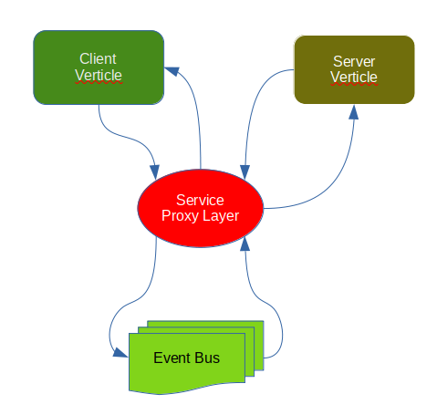

# Vertx.IO Service Proxy Visited

Vertx.IO is the must-have toolkit for those who seriously think about developing web API for the scalable scenario.
The toolkit is built around the reactive manifesto. It is based on netty.io, borrow actor model concept from erlang, 
seamlessly integrated with rxJava 2/3. The verticle (kind of actor) and eventbus make the multithread programming  
very enjoyable. 

In this document, we focus on the service proxy, which adds the abstract layer over the vertx eventbus so that the 
application developers dedicate more energy on the business application logic implementation instead of plumbing 
the eventbus among the verticles.



In particular, we focus on the following areas:
- use the latest gradle build tool (>7.0.2).
- use kotlin to configure the project
- where we need align the proxy client and proxy service.

## Detail Explained

### Step 1: define gradle.build.gradle.kts
The vertx service proxy uses the gradle annotationProcessor to generate the proxy codes. 

```kotlin
   plugins {
    id("com.resentek.java-application-conventions")
    //used to create uber fat jar
    id("com.github.johnrengelman.shadow") version("7.0.0")
}

dependencies {
    implementation("io.vertx:vertx-web")
    implementation("io.vertx:vertx-core"); 
    implementation("io.vertx:vertx-service-proxy")
    implementation("ch.qos.logback:logback-classic")
    compileOnly("io.vertx:vertx-codegen") 
    annotationProcessor("io.vertx:vertx-codegen:.*:processor")
    annotationProcessor("io.vertx:vertx-service-proxy")   
}

application {
  mainClass.set("io.vertx.core.Launcher")
}

//create a folder for those generated proxy java classes.
//but need to tell compiler the class path. Otherwise, can not compile.
  sourceSets {
      create("generated") {
        java.srcDir("${projectDir}/src/generated/java")
        compileClasspath = sourceSets["main"].compileClasspath
        runtimeClasspath = sourceSets["main"].runtimeClasspath 
      }
  }

tasks.jar {
  //need to tell Launcher to bootstrap our vertx system
    manifest() {
      attributes(
        mapOf("Main-Verticle" to 
          "com.resentek.app.BootstrapVerticle"))
    }
}

tasks.shadowJar {
   minimize(){
     //Laucher is not directly referenced, we need enforce to include core library when creating fatJar
     exclude(dependency("io.vertx:vertx-core"))
   }
}

//before compiling, we need to gerenate proxy files for our services 
val generateVertxProxyCodes = task<JavaCompile>("generateVerxProxyCodes") {
  source = sourceSets["main"].java
  classpath = sourceSets["main"].compileClasspath
  options.annotationProcessorPath = sourceSets["main"].compileClasspath
  options.compilerArgs.addAll(listOf(
            "-proc:only",
            "-processor", "io.vertx.codegen.CodeGenProcessor",
            "-Acodegen.output=${projectDir}/src/generated"
    ))
  destinationDir = file("${projectDir}/src/generated")
}

tasks.compileJava {
  dependsOn(generateVertxProxyCodes)
  //include "generated" sourceset
  source += sourceSets["generated"].java
  options.compilerArgs.plus("-proc:none")
}

tasks.clean {
  //need clean up generated classes.
  delete("${projectDir}/src/generated")
} 
```
### Step2: Define the Services (e.g. DBService)

Vertx uses the verticle to distribute your work (tasks) across threads who are 2 * CPU cores (by default). Definitely you can deploy your tasks (verticle) on the worker pool. Well, these verticles need communicate each other through event bus. 

Widthout service proxy, you have to do the plumbing work that is, 

```java
    EventBus ebus = vertx.eventBus();
    ebus.request("channel", {jsonObject}, {deliverOptionWithActionHeader})
    .onSuccess(AsyncResult->{})
    .onFailure(err->{})
```
These piecies of codes are repeated for each API provided by the producer service.

Now what if we have these codes generated by the service proxy during the compiling phase, then we have these codes:

```java
DBService service = DBService.createProxy(vertx, {channelName});
service.{ourApiName}
  .onSuccess(jsonObject -> {})
  .onFailure(err -> {})
```

As you see, the codes are more readable and maintainable. But what is the next step?

First, we need to define service interface with all APIs provided, as shown below. DBService has one API "getMenus"

```java
@ProxyGen // tell processor to generate proxy class
@VertxGen //tell processor to generate client stub class
public interface DBService {
    static DBService create(Vertx vertx){
        return new DBServiceImpl(vertx);
    }

    @GenIgnore
    static DBService createProxy(Vertx vertx, String address){
        return new DBServiceVertxEBProxy(vertx, address);
    }

    Future<JsonObject> getMenus(String page);
}
```

Second, we need define implementation. here is the DBServiceImpl.

```java
public class DBServiceImpl implements DBService {
	private Vertx vertx;

	public DBServiceImpl(Vertx vertx) {
		this.vertx = vertx;
	}

	public Future<JsonObject> getMenus(String page) {
		return Future.succeededFuture(
			new JsonObject()
				.put("page", page)
				.put("word","Hello")
				.put("action", "getMenus"));
	}

}
```
Now we can run the gradle compileJava to generate proxy shown below:

```sh
gradle compileJava
```

Third, from the service provider side (some verticle), we need to subscribe the channel on the event bus. The verticle (actor) has lifecycle (start() and stop()). We can put these codes in the start().

```java
// ServiceBinder is from io.vertx.service-proxy
new ServiceBinder(vertx)
      .setAddress({yourChannel})
      .register(DBService.class, new DBServiceImpl(vertx));
```

Forth, the consumer needs the way to call service provider through event bus, here is how-to:

```java
DBService service = DBService.createProxy(vertx, {yourChannel});
service.getMenus({pageName})
  .onSuccess(jsonObj ->{})
  .onFailure(err->{});
```

Note that those codes could be aligned to an specific router route in response to the HTTP request.

That's all we need to know in order to use the service proxy.

## How to run the project (linux)

step 1: open one terminal
```sh
> gradle build
> java -jar app/build/libs/app-all.jar
```

step 2: open another teminal
```sh
> curl localhost:8080/menus
```
You should see the return message
```json
{"page":"home","word":"Hello","action":"getMenus"}
```
The vertx-service-proxy is really awesome sub project. It indeed cleans up lots of plumbing codes. 
